# coding-agent-handoff

A skill that turns a chat conversation into a markdown brief your coding agent can build from.

You plan in a chat (**claude.ai** / **ChatGPT**); you build in a coding agent (**Claude Code**, **Codex**, **Cursor**, …). This skill writes the conversation up as a self-contained brief — decisions, context, and next steps — that you save into your repo or paste into the agent. It carries what the chat knows and the agent can't see, and treats anything about your code as an assumption to verify rather than fact.

Both platforms use the [Agent Skills](https://www.anthropic.com/engineering/equipping-agents-for-the-real-world-with-agent-skills) open standard, so the same skill installs in either.

## Install

Download **[`coding-agent-handoff.zip`](https://github.com/Aaryan-Kapoor/coding-agent-handoff/raw/master/coding-agent-handoff.zip)**, then:

- **claude.ai** — Settings → Capabilities → Skills → **+ → Create skill** → upload the zip.
- **ChatGPT** — Skills → **New skill → Upload from your computer** → select the zip. *(Beta on Business/Enterprise/Edu; an admin may need to enable skill uploads.)*
- **Claude Code / Codex** — drop this folder into the tool's skills directory; no upload needed.

Toggle it on, and you're set.

## Use

Ask for a handoff when you're ready to move work into your editor:

> *"Hand this off to my coding agent."* · *"Write this up so Claude Code can build it."* · *"Package this for Codex."*

You get a brief as an artifact/file. Either **save it** in your repo (e.g. `TASK.md`) and tell the agent *"read TASK.md and implement it,"* or **paste it** as your first message in a fresh agent session.
